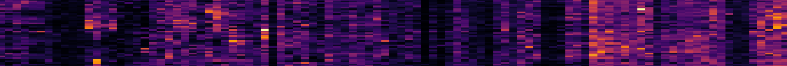

# Lung CosMx analysis

## Features

### Morphology (immunostaining):

* B2M/CD298, PanCK, CD45, CD3, DAPI

* CosMx™ Human Universal Cell Characterization RNA Panel (1000-plex)

## Samples

* 7 FFPE tissue samples
  
| Group                                   | Sample IDs                                      |
|-----------------------------------------|-------------------------------------------------|
| **3 Mycobacterium tuberculosis (MTB)**  | MTB1: 18_72_TB   MTB2: Lung_TB_18-78   MTB3: Lung_TB_18-79 |
| **4 Non-tuberculosis mycobacterium (NTM)** | NTM1: 18_76_NTM_MAC_pos   NTM2: 18_80_NTM_MAC_pos   NTM3: Lung_NTM_MAC_18-81   NTM4: 18_77_Bronchiectasis_MAC_neg |

* 15~ 47 FOVs per sample
* Seurat object and Giotto object are registered in figshare: [Figshare link](https://figshare.com/)

